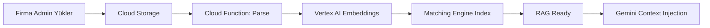
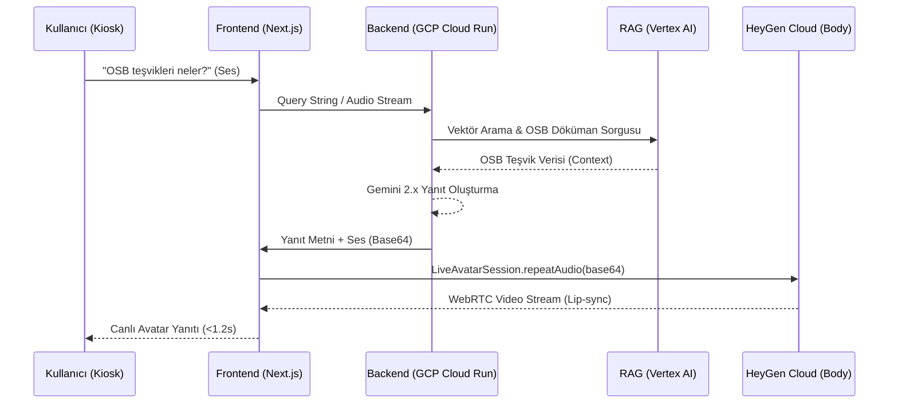

# Ürün Gereksinim Dokümanı (PRD): Canlı AI 3D Avatar SaaS Platformu (v2.0)

**Tarih:** 25 Aralık 2025  
**Versiyon:** 2.0 (Profesyonel Edisyon)  
**Durum:** Uygulamaya Hazır  
**Sorumlu:** Kıdemli Çözüm Mimarı & AI Ürün Yöneticisi

---

## 1. Ürün Vizyonu ve Özet

**Canlı AI 3D Avatar SaaS Platformu**, geleneksel arayüzleri insan benzeri, dinamik 3D etkileşimlere dönüştürmek için tasarlanmış bir "Dijital İnsan" ekosistemine sahiptir. **Gemini 2.x Multimodal Live API** kullanarak ultra düşük gecikme (<500ms) ile sesli ve görsel etkileşim sağlar.

Platform, kurumsal ortamlarda empatik bir köprü görevi görür—ister bir kiosk, ister bir web sitesi asistanı veya dahili bir API hizmeti olsun—şirketlerin cihazları uzaktan yönetmesine, özel bilgi yüklemesine (RAG) ve yüksek kaliteli 3D personaları özelleştirmesine olanak tanır.

---

## 2. Stratejik Kullanım Senaryoları ve Personalar

### 2.1 Kurumsal ve Operasyonel (Akıllı Danışma)
*   **Akıllı Resepsiyonist:** Fiziksel ofislerde veya fuar alanlarında ziyaretçileri karşılama, yol tarifi verme ve randevu sistemleriyle entegrasyon.
*   **[YENİ] İK ve Eğitim Uzmanı:** İlk aşama teknik mülakatlar, çatışma çözme eğitimi ve çalışan oryantasyon simülasyonları için özel olarak tasarlanmış bir persona.

### 2.2 Medya, Eğitim ve Kamu Hizmeti
*   **7/24 Canlı Sunucu:** Finansal verileri, hava durumunu veya haber akışlarını önceden kaydedilmiş video olmadan canlı veri kullanarak sunan dijital spiker.
*   **Kişisel Dil Öğretmeni:** Dil pratiği için sabırlı bir partner, öğrenci performansına göre hız ve ton ayarlama.

### 2.3 [YENİ] Dahili API Hizmeti
*   **Birleşik AI Motoru:** Platform, diğer dahili projeler için API olarak hizmet verecek şekilde tasarlanmıştır ve üçüncü taraf uygulamaların avatarın diyalog sistemini ve görsel durumunu tetiklemesine olanak tanır.

### 2.4 [YENİ] Elazığ OSB Müdürlüğü Kullanım Senaryosu

> [!NOTE]
> Bu senaryo, platformun **domain-specific RAG** yeteneklerini gösteren pilot uygulamasıdır.

**Bağlam:** Elazığ Organize Sanayi Bölgesi (OSB) giriş holünde 32 inç dikey Android kiosk.

**Hedef Kullanıcılar:**
1.  **Yatırımcılar:** OSB'deki sektörler, teşvikler, ulaşım hakkında bilgi almak isteyen potansiyel yatırımcılar.
2.  **Ziyaretçiler:** Firma ziyareti için gelen iş ortakları, yol tarifi ve firma bilgisi arayanlar.
3.  **Firma Çalışanları:** OSB altyapı hizmetleri, etkinlikler, duyurular hakkında bilgi almak isteyenler.

**Kritik Bilgi Kategorileri (Öncelik Sırasıyla):**
1.  **Firma Listesi ve İletişim:** 15+ firma, faaliyet alanları, iletişim bilgileri, tanıtım videoları.
2.  **Teşvikler ve Yatırım Bilgileri:** Devlet teşvikleri, arsa tahsisi, vergi muafiyetleri.
3.  **Ulaşım ve Altyapı:** OSB'ye ulaşım, elektrik/su/atık yönetimi, güvenlik hizmetleri.
4.  **Etkinlikler ve Duyurular:** Fuar katılımları, eğitim programları, resmi duyurular.

**Örnek Diyalog Akışı:**
```
Kullanıcı: "Merhaba, burada hangi firmalar var?"
Avatar: "Merhaba! Elazığ OSB'de 15'ten fazla firma faaliyet gösteriyor. 
         Tekstil, gıda, inşaat malzemeleri gibi sektörlerde çalışıyorlar. 
         Hangi sektör ilginizi çekiyor?"

Kullanıcı: "Tekstil firmaları hakkında bilgi ver."
Avatar: "Tekstil sektöründe X Tekstil ve Y Dokuma fabrikalarımız var. 
         X Tekstil hakkında daha fazla bilgi ister misiniz? 
         İsterseniz size yeni fabrikalarının tanıtım videosunu izletebilirim."

Kullanıcı: "Evet, video izleyelim."
Avatar: [Video player açılır, avatar sağ alt köşeye küçülür]
```

**Kapsam Dışı Örnek:**
```
Kullanıcı: "Hava durumu nasıl?"
Avatar: "Şu anda Elazığ OSB'de hava sıcaklığı 15 derece! 😊 
         Ama ben daha çok OSB'deki firmalar ve hizmetler hakkında 
         konuşmayı seviyorum. Size nasıl yardımcı olabilirim?"
```

---

## 3. Teknik Mimari ve Teknoloji Yığını

### 3.1 Frontend ve Görselleştirme
*   **Framework:** Yüksek performanslı sunucu taraflı rendering ve routing için Next.js 15 (App Router).
*   **3D Motor:** 60 FPS'de yüksek poligonlu GLB/GLTF modellerinin GPU hızlandırmalı render edilmesi için React Three Fiber (R3F) ve Three.js.
*   **Animasyon:** Glassmorphism UI geçişleri ve layout değişiklikleri için Framer Motion.
*   **Edge AI Algılama:** Cihaz üzerinde yüz takibi ve varlık tespiti için TensorFlow.js ve MediaPipe.

### 3.2 AI ve Diyalog Motoru & Görsel Sunum (Micro-Spec)
*   **Diyalog ve Mantık (Brain):** Gemini 2.x Multimodal Live API. Sesli/görsel çıktı üretimi ve RAG yönetimi.
*   **Görsel Avatar Sunumu (Body):** **HeyGen LiveAvatar Web SDK.**
    *   **SDK Core:** `@heygen/liveavatar-web-sdk` kütüphanesi üzerinden `LiveAvatarSession` yönetimi.
    *   **Mod Seçimi:** **CUSTOM Mode.** Gerçek zamanlı RAG yanıtlarının harici ses kanalı (L16 PCM / Base64) üzerinden HeyGen'e enjekte edilmesi.
*   **Oturum Yönetimi:**
    *   **Server-side:** Backend üzerinden HeyGen API Key ifşasını önlemek için `session_token` üretimi.
    *   **Client-side:** `LiveAvatarSession.start()` metodu ile WebRTC kanalının açılması ve `attach(element)` ile DOM'a bağlanması.
*   **Düşük Gecikme Akışı:** Gemini'den gelen metin/ses yanıtlarının `repeatAudio(base64)` metodu kullanılarak anlık dudağa yansıtılması.

### 3.3 Ses Portföyü
Sistem, mimari olarak optimize edilmiş 8 ses profili sunar:
*   **Kadın:** Aoede (Lirik), Kore (Empatik), Zephyr (Profesyonel), Leda (Otoriter).
*   **Erkek:** Charon (Derin), Fenrir (Dinamik), Puck (Genç), Orus (Nötr).

### 3.4 Google Cloud Ekosistemi ve Hibrit Mimari Stratejisi

Platform, **"Hibrit Mimari"** prensibi ile inşa edilmiştir:
*   **Real-time Döngüsü (Kod Tabanlı):** Hız ve düşük gecikme (<1.2s) için Python/FastAPI kullanılır.
*   **Orkestrasyon (n8n Tabanlı):** Veri yönetimi ve back-office işleri için `n8n.havsan.cloud` kullanılır.

Bu yapıda **"Brain-Body"** ayrımı esastır:
*   **Brain (Zeka):** GCP Vertex AI ve bizim backend'imiz (Zeka bizde kalır).
*   **Body (Sunum):** HeyGen WebRTC Streaming (Görsellik HeyGen'den gelir).

Platform aşağıdaki servisleri kullanır:

#### 3.4.1 Gemini 2.x Multimodal Live API
*   **Rol:** Platformun AI beyni. Sesli/görsel gerçek zamanlı etkileşim sağlar.
*   **Özellikler:**
    *   WebSocket üzerinden streaming audio (PCM format)
    *   Native TTS (Text-to-Speech) - harici TTS servisi gerektirmez
    *   Multimodal input (ses, metin, görüntü)
    *   Ultra düşük latency (< 700ms)
*   **Entegrasyon:** Frontend uygulaması doğrudan Gemini Live API WebSocket endpoint'ine bağlanır.

#### 3.4.2 Cloud Run (Backend API & Real-time Agent)
*   **Dil ve Framework:** **Python 3.11+ / FastAPI.**
    *   **Neden:** AI ekosistemi, LiveKit Agent SDK desteği ve ultra düşük gecikmeli asenkron (async) işlem yeteneği.
*   **Rol:**
    *   **Session Manager:** HeyGen için güvenli token üretimi.
    *   **Real-time Brain:** LiveKit odasına bağlanarak Gemini Live ve Vertex RAG orkestrasyonunu yönetir.
*   **Altyapı:** Cloud Run (Serverless). Trafik bazlı otomatik ölçekleme ve maliyet verimliliği.

#### 3.4.3 n8n (Opsiyonel Backend Asistanı - havsan.n8n.cloud)
*   **Rol:** Veri otomasyonu, döküman senkronizasyonu ve periyodik raporlama görevleri.
*   **Kritik:** Real-time konuşma döngüsünde yer almaz, sadece "back-office" işlerini yönetir.

#### 3.4.3 Vertex AI (RAG & Embedding)
*   **Rol:** Kurumsal doküman embedding'leri ve vector search.
*   **Bileşenler:**
    *   **Vertex AI Embeddings API:** Dökümanları (PDF/MD) yüksek boyutlu vektörlere çevirir.
    *   **Matching Engine:** Milyonlarca vektör arasında milisaniye düzeyinde semantik arama.
*   **Akış:**
    1. Şirket dökümanı yükler (Dashboard)
    2. Cloud Function dokümanı parse eder ve Vertex AI Embeddings'e gönderir
    3. Vektörler Matching Engine'e indexlenir
    4. Kullanıcı sorusu geldiğinde, soru embedding'i oluşturulur ve en yakın 5 doküman parçası çekilir
    5. Bu context Gemini Live API'ye "System Context" olarak enjekte edilir

#### 3.4.4 Cloud Storage
*   **Rol:** Avatar 3D modelleri (GLB/GLTF), şirket logoları, yüklenen dokümanlar için object storage.
*   **CDN Entegrasyonu:** Cloud CDN ile global edge cache, asset loading sürelerini minimize eder.

#### 3.4.5 Firebase (Authentication & Realtime DB)
*   **Rol:**
    *   **Firebase Authentication:** Admin ve cihaz login işlemleri için OAuth2/JWT yönetimi.
    *   **Firestore:** Cihaz durumu, kullanım logları, şirket konfigürasyonları için NoSQL veritabanı.
    *   **Realtime Database:** Kiosk cihazlarının anlık senkronizasyonu (canlı config update'leri).

#### 3.4.6 Cloud Monitoring & Logging
*   **Rol:** Sistem sağlığı, error tracking, performance metrikleri.
*   **Araçlar:**
    *   **Cloud Trace:** API latency analizi
    *   **Cloud Logging:** Merkezi log toplama (cihaz heartbeat, kullanıcı soruları)
    *   **Cloud Monitoring Dashboards:** KPI takibi (yanıt süresi, FPS, API çağrı sayısı)

#### 3.4.7 Kesin GCP Konfigürasyonu (AI Coding için)

> [!IMPORTANT]
> **Tek konfigürasyon** - Alternatif yöntemler yok.
> ⚠️ **UYARI:** GCP proje oluşturma yetkisi sadece **Atıf Hoca**'dadır. Junior mühendisler proje oluşturamaz.

**GCP Project Setup (Adım Adım):**

1.  **Yetki İsteği:** Atıf Hoca'ya proje detaylarını (ad, maliyet, süre) ileterek proje açılmasını talep edin.
2.  **Proje ID Tanımlama:** Atıf Hoca'nın verdiği ID'yi kullanın.

```bash
# Project ID (Atıf Hoca tarafından sağlanan)
PROJECT_ID="elazig-osb-avatar-prod"
REGION="europe-west1"  # En yakın Türkiye'ye
ZONE="europe-west1-b"

# Enable APIs (Yetki verildikten sonra)
gcloud config set project $PROJECT_ID

gcloud services enable \
  aiplatform.googleapis.com \
  run.googleapis.com \
  speech.googleapis.com \
  texttospeech.googleapis.com \
  storage.googleapis.com \
  firestore.googleapis.com \
  firebase.googleapis.com
```

**Cloud Run Service (Backend API):**
```yaml
# service.yaml
apiVersion: serving.knative.dev/v1
kind: Service
metadata:
  name: avatar-backend
  namespace: default
spec:
  template:
    metadata:
      annotations:
        autoscaling.knative.dev/minScale: "1"
        autoscaling.knative.dev/maxScale: "100"
        run.googleapis.com/cpu-throttling: "false"
    spec:
      containerConcurrency: 80
      timeoutSeconds: 300
      containers:
      - image: gcr.io/elazig-osb-avatar-prod/backend:latest
        resources:
          limits:
            cpu: "2"
            memory: "4Gi"
        env:
        - name: GEMINI_API_KEY
          valueFrom:
            secretKeyRef:
              name: gemini-api-key
              key: key
```

**Vertex AI Embeddings Config:**
```python
# embeddings_config.py
from google.cloud import aiplatform

aiplatform.init(
    project="elazig-osb-avatar-prod",
    location="europe-west1"
)

EMBEDDING_MODEL = "textembedding-gecko@003"
MATCHING_ENGINE_INDEX = "osb-documents-index"
DIMENSIONS = 768
```

**Firestore Database Structure:**
```javascript
// Firestore collections
/companies/{companyId}
  - name: string
  - logo_url: string
  - created_at: timestamp
  
/companies/{companyId}/documents/{docId}
  - filename: string
  - storage_path: string
  - embedding_status: "pending" | "completed" | "failed"
  - uploaded_at: timestamp

/companies/{companyId}/videos/{videoId}
  - title: string
  - storage_url: string
  - duration_sec: number

/devices/{deviceId}
  - company_id: string
  - location: string
  - last_heartbeat: timestamp
  - status: "online" | "offline" | "maintenance"
```

---

### 3.5 RAG Bilgi Kısıtlamaları ve Guardrails

> [!IMPORTANT]
> Avatar **yalnızca yüklenen dökümanlar** çerçevesinde yanıt verir. Kapsam dışı sorulara nazik ama net bir şekilde reddetme yanıtı verir.

#### 3.5.1 Bilgi Kaynakları ve Döküman Yönetimi

**Desteklenen Formatlar:**
*   **Metin Tabanlı:** PDF, DOCX, Markdown (MD), Excel (XLSX)
*   **Web İçeriği:** URL'den otomatik scraping (opsiyonel)
*   **Multimedya:** Tanıtım videoları (MP4, WebM) - avatar tarafından tetiklenebilir

**Firma Self-Service Dashboard:**
*   Her firma kendi **Firma Admin Arayüzü**nden dökümanlarını yükleyebilir.
*   Değişiklikler **anlık olarak** RAG vektör veritabanına yansır.
*   Ortalama döküman sayısı: **15 adet/firma**.
*   Güncelleme sıklığı: **Firma tarafından belirlenebilir** (anlık, günlük, aylık).

**Döküman İşleme Pipeline:**


#### 3.5.2 Bilgi Sınırları ve Confidence Threshold

**Confidence Threshold: %85**
*   Avatar, RAG'den çektiği bilgiye **%85 veya üstü güven** duyuyorsa yanıt verir.
*   %85 altında: `"Bu konuda emin değilim, lütfen daha spesifik bir soru sorun."`

**Kapsam Dışı Soru Yönetimi:**

| Soru Tipi | Avatar Yanıtı | Ton |
| :--- | :--- | :--- |
| **Tamamen kapsam dışı** ("Hava durumu?") | "Bu konuda bilgim yok, ama OSB firmaları hakkında soru sorabilirsiniz." | Nazik, yönlendirici |
| **Esprili reddetme** (opsiyonel) | "Şu anda Elazığ OSB'de hava sıcaklığı 15 derece! 😊 Ama ben OSB firmaları hakkında konuşmayı tercih ederim." | Samimi, eğlenceli |
| **Gri alan** ("Elazığ'da restoran?") | "Elazığ hakkında genel bilgim sınırlı, ama OSB içindeki tesisler hakkında yardımcı olabilirim." | Duru, sınır çizen |
| **Belirsiz soru** ("Firma bilgisi ver") | "Hangi firmayı merak ediyorsunuz? Tekstil, gıda, inşaat gibi sektörlerimiz var." | İnteraktif, soru soran |

**Halüsinasyon Önleme:**
*   Avatar, RAG'de **olmayan bir bilgiyi asla uydurmaz**.
*   Eğer soru yanıtlanamayacaksa: `"Bu bilgi dökümanlarımda yok. Lütfen OSB müdürlüğüne başvurun."`
*   Tüm reddedilen sorular **Cloud Logging**'e kaydedilir (iyileştirme için).

#### 3.5.3 Multimedya Entegrasyonu (Video Tetikleme)

**Özellik:** Avatar, firma tanıtım videolarını gösterebilir.

**Akış:**
1.  Kullanıcı: "X firmasının fabrikasını görmek istiyorum."
2.  Avatar: "Tabii! Şimdi size X firmasının yeni fabrikasının videosunu izleteceğim."
3.  **UI Değişimi:**
    *   Avatar **sağ alt köşeye** küçülür (Info Mode).
    *   Ana ekranda **video player** açılır (Cloud Storage'dan stream).
    *   Video bitince avatar tekrar merkeze döner.

**Teknik Detay:**
```json
// Gemini API Response (video trigger)
{
  "text_response": "Şimdi size videosunu izleteceğim.",
  "action": {
    "type": "play_video",
    "video_url": "https://storage.googleapis.com/osb-videos/x-firma.mp4",
    "duration_sec": 120
  }
}
```

#### 3.5.4 Test Senaryoları ve Edge Case'ler

| Senaryo | Kullanıcı Girdisi | Beklenen Avatar Yanıtı |
| :--- | :--- | :--- |
| **Kayıtsız firma** | "Z firması ne iş yapıyor?" | "Z firması OSB'de kayıtlı değil. Mevcut firmalarımızı listeleyeyim mi?" |
| **Belirsiz kriter** | "En büyük firma hangisi?" | "Hangi kritere göre? Çalışan sayısı, üretim kapasitesi veya ciro?" |
| **Greeting** | "Merhaba" | "Merhaba! Size nasıl yardımcı olabilirim? OSB firmaları, teşvikler veya ulaşım hakkında bilgi alabilirsiniz." |
| **Existential** | "Buraya nasıl geldim?" | "Bu konuda bilgim yok! 😊 Ama OSB'ye nasıl ulaşılacağını anlatabilirim." |
| **Çoklu soru** | "Firmalar ve teşvikler neler?" | "İki soru sordunuz! Önce firmaları mı yoksa teşvikleri mi konuşalım?" |

### 3.6 Uygulama Klasör Yapısı (Project Structure)

> [!TIP]
> **Standart HAVSAN Yapısı:** Next.js frontend ve Cloud Functions backend ayrımı.

```bash
elazig-osb-avatar/
├── .github/workflows/          # CI/CD Pipeline (Cloud Run Deploy)
├── docs/                       # Mimari diyagramlar ve API dokümantasyonu
├── frontend/                   # Next.js 15 (App Router)
│   ├── src/
│   │   ├── app/                # Pages & Routes
│   │   ├── components/         # 3D Avatar, VideoPlayer, UI Widgets
│   │   │   ├── avatar/         # R3F Canvas & GLB Models
│   │   │   └── dashboard/      # Admin panel bileşenleri
│   │   ├── lib/                # Utility functions (Firebase, Gemini API)
│   │   ├── hooks/              # Custom React Hooks (useAvatar, useSpeech)
│   │   └── types/              # TypeScript tanımları
│   ├── public/                 # Static assets (images, fonts)
│   ├── next.config.js
│   └── tailwind.config.ts
├── backend/                    # Cloud Functions / Cloud Run Service (Python/Node)
│   ├── src/
│   │   ├── api/                # REST Endpoints
│   │   ├── services/           # Business Logic (RAG, Matching Engine)
│   │   └── models/             # Pydantic/Zod schemas
│   ├── Dockerfile              # Cloud Run container def
│   └── requirements.txt
└── firebase/                   # Firestore rules & Indexes
```

---


## 4. SaaS Altyapısı ve Cihaz Yönetimi

### 4.1 Yönetici Komuta Merkezi (Dashboard)

**Ana Dashboard (Platform Admin):**
*   **Kimlik Doğrulama:** OAuth2/JWT güvenli çok kiracılı yapı.
*   **Şirket Yönetimi:** Yeni şirket ekleme, lisans yönetimi, kullanım kotaları.
*   **Karakter Laboratuvarı:** 3D modellerin ve ses parametrelerinin seçimi ve yapılandırması.
*   **Analitik:** Tüm şirketlerin kullanım telemetrisi, global KPI dashboards.

**Firma Admin Arayüzü (Self-Service):**

> [!TIP]
> **Alternatif Yöntem: Google Sheets**
> Küçük ölçekli veya hızlı başlangıç gerektiren durumlarda, özel bir admin paneli yerine **Google Sheets + Apps Script** kullanılabilir.
> *   Firma bilgileri Sheets'e girilir.
> *   Apps Script, veriyi JSON formatında Cloud Storage'a veya Firestore'a senkronize eder.
> *   **Maliyet:** $0, **Geliştirme:** 1 gün.

> [!NOTE]
> Her firma kendi bilgilerini bağımsız olarak yönetir.

*   **İçerik Yönetimi:**
    *   Sürükle-bırak ile döküman yükleme (PDF, DOCX, MD, Excel)
    *   Video yükleme (MP4, WebM) - Cloud Storage'a otomatik upload
    *   Döküman versiyonlama ve silme
*   **Bilgi Kategorileri:**
    *   Firma profili (ad, logo, iletişim, faaliyet alanı)
    *   Ürün/hizmet katalogları
    *   Tanıtım materyalleri (broşürler, videolar)
    *   SSS (Sıkça Sorulan Sorular)
*   **Avatar Konfigürasyonu:**
    *   **Avatar Seçimi:** HeyGen Kütüphanesi veya Özel Video Avatar (Atıf Hoca).
    *   **Zeka (Brain) Entegrasyonu:** Gemini Live API Endpoint tanımlama.
    *   **Ses Portföyü:** ElevenLabs veya HeyGen dahili sesler arasından seçim.
*   **Analitik & Telemetri (Real-time):**
    *   **Bağlantı Kalitesi (Connection Quality):** Kioskların WebRTC sinyal gücü takibi.
    *   **Oturum Durumu (Session State):** Kaç cihaz şu an "active speaking" veya "stream ready" durumunda.
    *   **Kredi Tüketimi:** Dakika bazlı HeyGen kredi kullanım raporları.

**Dashboard Ekran Görüntüsü (Wireframe):**
```
+------------------------------------------+
| [Logo] Firma Admin Panel      [Logout]  |
+------------------------------------------+
| 📁 Dökümanlarım | 🎥 Videolar | 🤖 Avatar | 📊 Analitik |
+------------------------------------------+
| 📄 firma_profili.pdf      [Sil] [Güncelle] |
| 📄 urun_katalogu.xlsx    [Sil] [Güncelle] |
| 🎥 fabrika_turu.mp4      [Sil] [Güncelle] |
|                                          |
| [+ Yeni Döküman Ekle]                    |
+------------------------------------------+
```

### 4.1.1 Dashboard API & Sitemap

**Frontend Routes (Sitemap):**

| Route | Açıklama | Erişim |
| :--- | :--- | :--- |
| `/login` | Yönetici girişi | Public |
| `/dashboard` | Genel bakış ve metrikler | Admin/Firma |
| `/dashboard/documents` | Döküman yükleme ve yönetimi | Firma |
| `/dashboard/videos` | Video kütüphanesi | Firma |
| `/dashboard/avatar` | Karakter özelleştirme | Firma |
| `/admin/companies` | Şirket yönetimi (Create/Edit) | Super Admin |
| `/admin/devices` | Kiosk cihaz eşleştirme ve durum | Super Admin |

**Backend API Endpoints:**

| Method | Endpoint | Açıklama |
| :--- | :--- | :--- |
| `POST` | `/api/v1/auth/login` | JWT token üretimi |
| `GET` | `/api/v1/heygen/token` | HeyGen `session_token` üretimi (Backend-to-HeyGen) |
| `GET` | `/api/v1/companies` | Firma listesi (Admin) |
| `POST` | `/api/v1/companies/{id}/upload` | Döküman upload (Signed URL) |
| `POST` | `/api/v1/chat/query` | RAG & Gemini Yanıt Üretimi (Brain-to-Frontend) |
| `POST` | `/api/v1/rag/sync` | RAG indeksini tetikle |
| `GET` | `/api/v1/devices/status` | Tüm cihazların heartbeat durumu |
| `POST` | `/api/v1/devices/pair` | Cihaz aktivasyonu (QR Code) |

### 4.2 Kiosk/Cihaz Aktivasyonu (Cihazdan Buluta Eşleştirme)
1.  **QR Eşleştirme:** Kiosk, tek seferlik bir aktivasyon kodu/QR gösterir.
2.  **Haritalama:** Yönetici, Dashboard üzerinden cihazı belirli bir konuma (örn: "A Binası Girişi") bağlar.
3.  **Kalıcılık:** Kalıcı JWT Refresh Token mekanizması, cihazın yeniden başlatıldıktan sonra bile kimliği doğrulanmış olarak kalmasını sağlar.

### 4.3 Kiosk Donanım Spesifikasyonları

**Hedef Cihaz:** 32 inç dikey (portrait) Android ekran, taşınabilir stand.

**Teknik Gereksinimler:**

| Bileşen | Spesifikasyon | Gerekçe |
| :--- | :--- | :--- |
| **Ekran** | 32" IPS LCD, 1080x1920 (Full HD portrait) | Yüksek çözünürlük avatar render için |
| **İşlemci** | Qualcomm Snapdragon 8 Gen 2 veya eşdeğeri | WebGL/Three.js 60 FPS performansı |
| **RAM** | 8GB minimum, 12GB önerilen | Çoklu tab/video streaming için |
| **Depolama** | 128GB NVMe SSD | Hızlı asset loading, video cache |
| **Kamera** | 1080p 30fps, wide-angle (120°) | Kullanıcı algılama (TensorFlow.js) |
| **Mikrofon** | Array mikrofon (noise cancellation) | Gürültülü ortamda ses tanıma |
| **Hoparlör** | Stereo, 10W x 2 | Net ses çıkışı (kalabalık ortam) |
| **Bağlantı** | Wi-Fi 6, Ethernet (backup), 4G LTE (opsiyonel) | Kesintisiz bağlantı |
| **Güç** | 12V DC, UPS destekli (30dk backup) | Elektrik kesintisinde süreklilik |
| **İşletim Sistemi** | Android 13+ (AOSP) veya Linux (Ubuntu 22.04) | PWA/Web app desteği |

**Fiziksel Tasarım:**
*   **Yükseklik:** 150-170cm (göz hizası)
*   **Taban:** Ağırlıklı metal stand (devrilme önleme)
*   **Taşınabilirlik:** Tekerlekli (fuar/etkinlik için)
*   **Kablo Yönetimi:** Gizli kablo kanalı

**Referans Görsel:**


**Deployment Senaryoları:**
1.  **Sabit Kurulum:** Elazığ OSB giriş holü - 7/24 çalışır, elektrik bağlantılı.
2.  **Fuar/Etkinlik:** Taşınabilir, 4G LTE ile bağlantı, pil desteği.
3.  **Web Yayını:** Aynı avatar sistemi web sitesine embed edilebilir (responsive design).

**Fiyatlandırma ve Tedarikçiler (Aralık 2025):**

| Tedarikçi | Model | Fiyat (USD) | Özellikler | Link |
| :--- | :--- | ---: | :--- | :--- |
| **ScreenMoove** | 32" Commercial Portrait | $315-$380 | Android, 24/7, Full HD | [screenmoove.com](https://screenmoove.com) |
| **GARQA** | 32" Touchscreen Kiosk | $366-$422 | Android 9.0, 10-point touch | [garqa.com](https://garqa.com) |
| **AliExpress** | Smart Digital Kiosk | $663 | Android Tablet, Portable | [aliexpress.com](https://aliexpress.com) |
| **Displays2Go** | 32" Android Display | $831 | Android 11, Commercial grade | [displays2go.com](https://displays2go.com) |

**Önerilen Konfigürasyon (Elazığ OSB):**
*   **Tedarikçi:** GARQA (maliyet/performans dengesi)
*   **Model:** 32" Anti-Glare Capacitive Touchscreen
*   **Fiyat:** ~$422 (birim başı)
*   **Miktar:** 2 adet (1 OSB girişi, 1 yedek/fuar)
*   **Toplam Donanım Maliyeti:** $844

### 4.4 Bakım ve Arıza Senaryoları

> [!WARNING]
> Fiziksel cihazlar için kapsamlı bakım planı gereklidir.

#### 4.4.1 Önleyici Bakım (Preventive Maintenance)

**Haftalık:**
*   Ekran temizliği (mikrofiber bez, alkolsüz temizleyici)
*   Kamera lens temizliği
*   Mikrofon grill kontrolü
*   Fiziksel hasar kontrolü (kırık, çatlak)

**Aylık:**
*   Sistem log analizi (Cloud Logging)
*   Disk alanı kontrolü (cache temizliği)
*   Bağlantı hızı testi (Wi-Fi/Ethernet)
*   UPS pil testi

**Üç Aylık:**
*   Firmware güncellemesi (Android OS)
*   Donanım diagnostics (CPU sıcaklık, RAM kullanımı)
*   Stand stabilite kontrolü (vida sıkma)

#### 4.4.2 Arıza Senaryoları ve Çözümleri

**Senaryo 1: İnternet Bağlantısı Kesildi**

| Durum | Sistem Davranışı | Çözüm |
| :--- | :--- | :--- |
| **Wi-Fi koptu** | Otomatik Ethernet'e geçiş (failover) | 5 saniye içinde otomatik |
| **Tüm bağlantı yok** | Offline mod: "Bağlantı sorunu, lütfen bekleyin" mesajı | 4G LTE backup (opsiyonel) |
| **30dk+ offline** | Cloud Monitoring alert gönder (SMS/Email) | Teknik ekip müdahale |

**Senaryo 2: Ekran Arızası**

| Arıza Tipi | Belirti | Akşiyon |
| :--- | :--- | :--- |
| **Dokunmatik çalışmıyor** | Kullanıcı etkileşim yok | Sesli mod aktif et, ekran sadece görüntü |
| **Ekran söndü** | Tamamen siyah | Otomatik reboot (3 deneme), sonra alert |
| **Fiziksel hasar** | Çatlak, kırık | Cihazı devre dışı bırak, yedek cihaz aktif et |

**Senaryo 3: Ses Sistemi Arızası**

| Arıza | Tespit | Çözüm |
| :--- | :--- | :--- |
| **Mikrofon çalışmıyor** | Speech-to-Text API hata dönüyor | Ekranda klavye göster (metin girişi) |
| **Hoparlör sessiz** | TTS audio output yok | Ekranda subtitle göster (metin yanıt) |
| **Gürültü çok yüksek** | Confidence score < %50 | "Lütfen daha sessiz ortamda konuşun" |

**Senaryo 4: Yazılım Crash**

| Hata | Log Kaydı | Otomatik İyileştirme |
| :--- | :--- | :--- |
| **Frontend crash** | JavaScript exception | Sayfa otomatik yenileme (5s içinde) |
| **Backend timeout** | Cloud Run 504 error | Retry logic (3 deneme, exponential backoff) |
| **3D render donması** | FPS < 10 (5s+) | LOD seviyesi düşür, texture quality azalt |

#### 4.4.3 Uzaktan Tanı ve Müdahale

**Cloud Monitoring Dashboard:**
```
+--------------------------------------------------+
| Cihaz: OSB-KIOSK-001          Status: 🟢 Online  |
+--------------------------------------------------+
| CPU: 45%  | RAM: 3.2GB/8GB | Disk: 45GB/128GB  |
| Uptime: 7d 14h | Last Heartbeat: 2s ago          |
| Network: Wi-Fi (85 Mbps) | Temp: 42°C           |
+--------------------------------------------------+
| Son 24 Saat:                                     |
| - 127 kullanıcı etkileşimi                      |
| - 3 video oynatma                                |
| - 0 hata                                         |
+--------------------------------------------------+
| [Reboot] [Update Firmware] [View Logs] [Disable]|
+--------------------------------------------------+
```

**Uzaktan Komutlar:**
*   **Reboot:** Cloud Pub/Sub message ile cihazı yeniden başlat
*   **Config Update:** Firestore'da konfig değiştir, cihaz realtime sync
*   **Log Export:** Son 7 gün logları Cloud Storage'a export
*   **Disable:** Cihazı bakım moduna al ("Geçici olarak hizmet dışı" mesajı)

#### 4.4.4 Yedek Cihaz Protokolü

**Senaryo:** Ana kiosk arızalandı, yedek cihaz devreye girecek.

**Akşiyon Planı (15 dakika içinde):**
1.  **Dashboard'dan ana cihazı disable et** (2 dk)
2.  **Yedek cihazı fiziksel olarak kur** (5 dk)
3.  **Dashboard'dan yedek cihazı "OSB Girişi" lokasyonuna ata** (2 dk)
4.  **QR kod ile aktivasyon** (1 dk)
5.  **Test etkileşimi** (5 dk)

**Gerekli Malzemeler:**
*   Yedek kiosk (her zaman şarjında, güncel firmware)
*   Ethernet kablosu (Wi-Fi yerine hızlı kurulum)
*   Allen anahtar seti (stand montajı)
*   QR kod kılavuzu (aktivasyon için)

---

## 5. Fonksiyonel Gereksinimler ve UX Tasarımı

### 5.1 Yaşayan Avatar Mekanikleri
*   **Bekleme Durumu:** Doğal nefes alma, düzensiz göz kırpma (3-7s aralıklarla) ve ince mikro hareketler.
*   **Etkileşim Modu:** Varlık tespitinde (<1.5m) anında göz teması.
*   **Müdahale Mantığı:** Kullanıcı konuşmaya başladığında avatarın anında susması.

### 5.2 Adaptif UI Modları
*   **Odak Modu:** Derin konuşma için avatar merkezde.
*   **Bilgi Modu:** Avatar, haritalar, dokümanlar veya veri widget'ları gösterilirken sorunsuzca **sağ alt köşeye** geçiş yapar.

### 5.3 Dudak Senkronizasyonu ve Duygu
*   **Viseme Senkronizasyonu:** Gerçek zamanlı ses genliğinin 52 ARKit Blendshape'e eşlenmesi.
*   **Düşünme Durumu:** Ağ gecikmesini maskelemek için ince baş eğme veya "dinleme" jestleri.

### 5.4 3D Avatar Üretimi: HeyGen LiveAvatar Web SDK (Teknik İç Yapı)

> [!IMPORTANT]
> **Tek Çözüm (Aralık 2025):** HeyGen LiveAvatar Web SDK kullanılacak. Mimari, "Custom Intelligence Integration" (Harici Zeka Entegrasyonu) prensibi üzerine kuruludur.

#### 5.4.1 Yazılım Mimari Bileşenleri
*   **`LiveAvatarSession`:** SDK'nın kalbidir. Oturum yaşam döngüsünü (start, stop, interrupt) yönetir.
*   **`VoiceChat` & `AgentEvents`:** Kullanıcı ve avatarın konuşma durumlarını (vAD) `USER_SPEAK_STARTED`, `AVATAR_SPEAK_ENDED` event'leri ile asenkron takip eder.
*   **`CUSTOM` Mod Akışı:** `repeatAudio(audio_base64)` metodu sayesinde zeka tamamen backend'imizde kalır, HeyGen sadece görsel sunucudur.

#### 5.4.2 RAG Destekli Diyalog Akışı (Deep-Tech)



#### 5.4.3 Kritik SDK Entegrasyon Parametreleri
*   **Konfigürasyon:** `voiceChat: true`, `apiUrl: API_URL` (HeyGen Endpoint).
*   **Event Listeners:**
    *   `SESSION_STREAM_READY`: Video akışının başarılı bir şekilde DOM'a bağlandığını doğrular.
    *   `USER_SPEAK_STARTED`: Arama sırasında avatarın anlık olarak "interrupt()" edilmesini sağlar.
*   **Oturum Sürekliliği:** `keepAlive()` metodu ile 5 dakikayı aşan kiosk bekleme sürelerinde WebRTC kanalının canlı tutulması.

---

## 6. Güvenlik, Gizlilik ve Uyumluluk

*   **Tasarımla Gizlilik:** Görüntü işleme (TensorFlow.js) edge'de kalır; buluta video verisi gönderilmez.
*   **Sıfır Saklama:** Konuşmaların geçici işlenmesi; oturum sonrası bellek temizlenir.
*   **Veri İzolasyonu:** Her kiracının RAG verisi için şifrelenmiş namespace'ler.

---

## 8. Uygulama Yol Haritası ve Bütçe

### 8.1 Tahmini Bütçe (Aylık - MVP Aşaması)

| Kalem | Servis | Maliyet | Not |
| :--- | :--- | :--- | :--- |
| **AI Motoru** | HeyGen LiveAvatar | $99/ay | Essential Plan (1000 Kredi) |
| **Akıl ve Ses** | Gemini Live API | ~$50/ay | Kullanım bazlı (GCP) |
| **Vektör Verisi** | Vertex AI / Firestore | ~$20/ay | Veri boyutuna bağlı |
| **Hosting** | Cloud Run / CDN | ~$30/ay | Otomatik ölçekleme |
| **Toplam** | | **~$200/ay** | **MVP İşletim Maliyeti** |

### 8.1 Mimari Diyagram


### 8.2 Geliştirme Fazları

#### Faz 1: MVP - Temel Kiosk (4-6 Hafta)
*   **Hedef:** Tek lokasyon için çalışan bir prototip.
*   **Kapsam:**
    *   Next.js frontend + Three.js ile basit 3D avatar
    *   Gemini Live API entegrasyonu (sesli soru-cevap)
    *   Firebase Authentication (admin login)
    *   Cloud Storage'a doküman yükleme
    *   Basit RAG (Vertex AI Embeddings + manual search)
*   **Çıktılar:**
    *   Çalışan web uygulaması (localhost + Cloud Run deploy)
    *   1 adet test cihazı (tablet/kiosk)

#### Faz 2: Statik Fotoğraf Lip-Sync (2-3 Hafta)
*   **Hedef:** 3D model yerine gerçek fotoğraf kullanımı.
*   **Kapsam:**
    *   Wav2Lip/SadTalker model Cloud Run'a deploy
    *   Offline clip generation pipeline
    *   Frontend video player entegrasyonu
*   **Çıktılar:**
    *   Şirket fotoğrafından 20 standart cümle video kütüphanesi
    *   Smooth video transition logic

#### Faz 3: SaaS Dashboard (3-4 Hafta)
*   **Hedef:** Şirketlerin self-service olarak sistemleri yapılandırması.
*   **Kapsam:**
    *   Admin Dashboard (React/Next.js)
    *   Multi-tenancy (her şirket için isolated Firestore collection)
    *   Device pairing (QR code generation)
    *   Analytics dashboard (Cloud Monitoring entegrasyonu)
*   **Çıktılar:**
    *   SaaS platformu (saas.avatarai.io domain)
    *   Fiyatlandırma katmanları (Starter/Pro/Enterprise)

#### Faz 4: Realtime Lip-Sync ve Ölçeklendirme (4-6 Hafta)
*   **Hedef:** Gerçek zamanlı video üretimi ve global deployment.
*   **Kapsam:**
    *   GPU-enabled Cloud Run (NVIDIA T4)
    *   WebRTC streaming pipeline
    *   Global CDN (Cloud CDN + Firebase Hosting)
    *   Auto-scaling policies (GKE ile Kubernetes cluster)
*   **Çıktılar:**
    *   100+ eş zamanlı cihaz desteği
    *   <2s end-to-end latency globally

### 8.3 Maliyet Tahmini (Aylık - Orta Ölçekli Deployment)

| Servis | Kullanım | Tahmini Maliyet (USD) |
| :--- | :--- | ---: |
| **Gemini Live API** | 10,000 konuşma (avg 2dk) | $300-500 |
| **Cloud Run** | 100 vCPU saat, 200GB RAM | $50-80 |
| **Vertex AI Embeddings** | 500K token/month | $20-30 |
| **Cloud Storage** | 100GB + 1TB egress | $15-25 |
| **Firestore** | 50M okuma, 10M yazma | $20-30 |
| **Cloud CDN** | 500GB bandwidth | $40-60 |
| **GPU (Realtime Lip-Sync)** | NVIDIA T4, 100 saat | $150-200 |
| **TOPLAM** |  | **$595-925** |

> [!WARNING]
> Realtime lip-sync kullanımı maliyetleri 3-4x artırabilir. MVP aşamasında offline yaklaşım önerilir.

### 8.4 Alternatif Yaklaşımlar ve Optimizasyonlar

#### Hibrit Model: 3D Avatar + Photo Overlay
*   3D mesh'i iskelet (skeleton) olarak kullan.
*   Fotoğrafı texture olarak üstüne uygula.
*   Gemini ses output'unu ARKit Blendshape'lere map et.
*   **Avantaj:** Daha doğal animasyon, düşük maliyet.

#### Open Source Stack Alternatifleri
*   **Gemini yerine:** Google'ın PaLM 2 API (daha ucuz ama multimodal yok)
*   **Cloud Run yerine:** GKE (daha fazla kontrol, ama yönetim yükü)
*   **Vertex AI yerine:** Pinecone veya Weaviate (managed vector DB)

---

## 9. Sonuç ve Stratejik Öneriler

> [!NOTE]
> Bu PRD, "Beyond Presence AI Agent" teknik çalışmasına uygulanan master prompt'lardan türetilen yol haritasını içerir ve mimarinin hem bağımsız kiosk'ları hem de global API kullanılabilirliğini desteklediğinden emin olur.

### Kritik Başarı Faktörleri
1.  **Gemini Live API Stabilitesi:** Google'ın SLA garantileri production-ready olmalı.
2.  **Lip-Sync Kalitesi:** Uncanny valley etkisinden kaçınmak için yüksek fidelity gerekli.
3.  **Multi-Tenancy Güvenliği:** Her şirketin verisi mutlak izolasyonda olmalı (GDPR/KVKK uyumu).
4.  **Maliyet Kontrolü:** Realtime GPU kullanımında auto-scaling threshold'ları dikkatle ayarlanmalı.

### Hızlı Başlangıç Aksiyonları
-   [ ] Google Cloud hesabı aç ve $300 ücretsiz krediyi aktifleştir
-   [ ] Gemini API erişimi için waitlist'e kaydol (cloud.google.com/vertex-ai/generative-ai)
-   [ ] Wav2Lip repository'sini fork'la ve Cloud Run'a deploy et
-   [ ] Next.js + Three.js boilerplate projesi oluştur
-   [ ] İlk test fotoğrafı ile lip-sync proof-of-concept çalıştır
